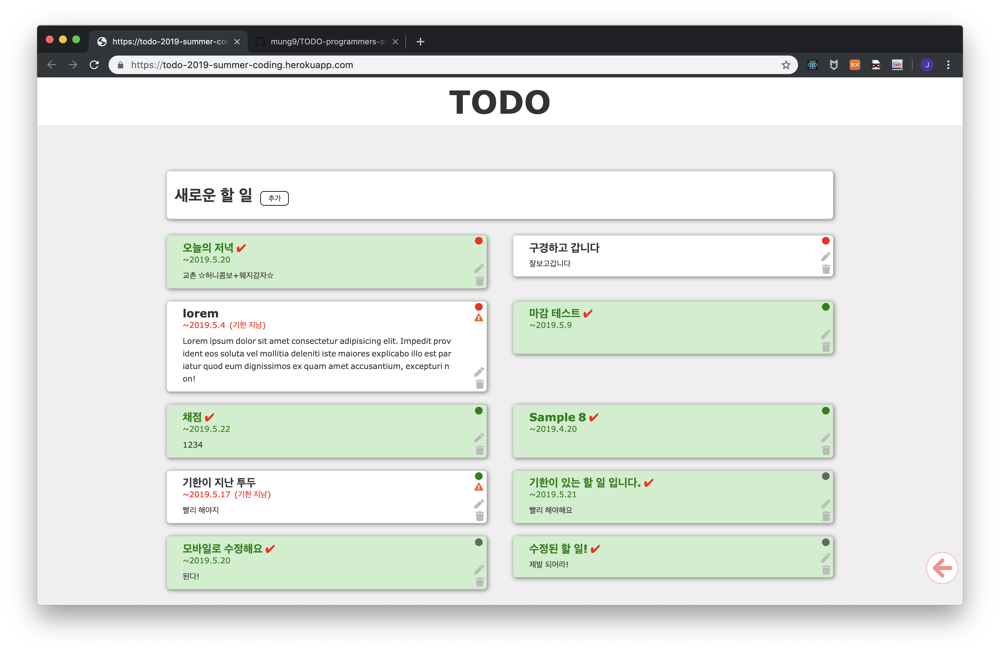

# TODO
> 프로그래머스 2019 섬머코딩 과제

![node Version][node-image] ![npm Version][npm-image]


프로그래머스 2019 섬머코딩 과제로 제출하는 프로젝트입니다.

<!-- 실행 화면 캡쳐 -->
 

## 기본 요구사항

<!--  웹서버를 리눅스 기준으로 실행하기 위해 필요한 설치
및 빌드 방법 -->
실행을 위해 [Node.js](https://nodejs.org/ko/)와 [MongoDB](https://www.mongodb.com/)가 필요합니다.

### Node.js (10.x)

Node.js는 [여기](https://nodejs.org/ko/)에서 설치할 수 있습니다.
혹은 명령창에서 다음 명령어로 설치할 수 있습니다.
```shell
$ sudo curl -sL https://deb.nodesource.com/setup_10.x | sudo bash -
$ sudo apt install nodejs
```

아래의 명령어를 통해 nodejs와 npm이 설치되었음을 확인합니다.
```shell
$ node --version
v10.15.3
$ npm --version
6.4.1
```

### MongoDB (4.x)
MongoDB는 [여기](https://www.mongodb.com/download-center/community)에서 설치할 수 있습니다. 혹은 [여기](https://docs.mongodb.com/manual/tutorial/install-mongodb-on-ubuntu/)를 참고하여 명령창을 통해 설치할 수 있습니다.
```shell
$ mongod --version
db version v4.0.6
```

---

## 설치 및 실행

프로젝트를 원하는 디렉토리로 가져옵니다.

```shell
$ cd directory/path/you/want
$ git clone https://github.com/mung9/TODO-programmers-summer-coding.git
```

### 서버 빌드 종속성 설치
프로젝트의 루트 디렉토리로 이동하여 아래 명령어를 실행합니다. 
서버 구동에 필요한 패키지들을 자동으로 설치해줍니다.
```shell
$ cd TODO-programmers-summer-coding
$ npm install
```

### 클라이언트 빌드
`client` 디렉토리로 이동하여 클라이언트 애플리케이션 빌드에 필요한 패키지를 자동으로 설치합니다.
```shell
$ cd client
$ npm install
```

프로젝트의 루트 디렉토리로 돌아와서 아래 명령어를 입력하여 클라이언트 애플리케이션을 빌드합니다. `client/public` 디렉토리에 파일이 생성됩니다.
```shell
$ npm run client
```

### MongoDB 실행
별도의 터미널 창에서 다음 명령을 실행하여 mongodb를 실행합니다.
```shell
$ sudo mongod
```

### 서버 설정
기본 동작으로 서버의 포트는 `8080`으로 할당됩니다.
환경변수 `PORT`를 설정하여 변경할 수 있습니다.
```shell
$ export PORT=8282
```

### 서버 시작
이제, 서버를 실행할 수 있습니다.
```shell
$ npm start
```

### 실행 결과 확인
인터넷 브라우저에서 `localhost:{PORT}` (예: `localhost:8080`)로 접속하여 확인합니다.

<!-- Markdown link & img dfn's -->
[node-image]: https://img.shields.io/badge/node-10.15.3-green.svg
[npm-image]: https://img.shields.io/badge/npm-6.4.1-red.svg
[npm-url]: https://npmjs.org/package/datadog-metrics
[npm-downloads]: https://img.shields.io/npm/dm/datadog-metrics.svg?style=flat-square
[travis-image]: https://img.shields.io/travis/dbader/node-datadog-metrics/master.svg?style=flat-square
[travis-url]: https://travis-ci.org/dbader/node-datadog-metrics
[wiki]: https://github.com/yourname/yourproject/wiki
